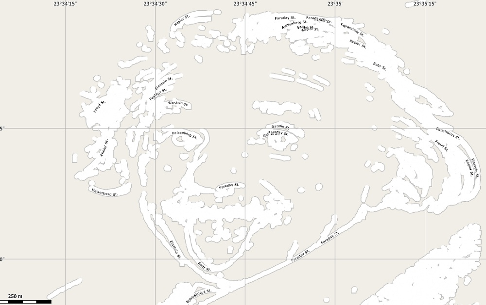

I started working on the image processing part, using the [OpenCV framework](http://opencv.org/). For this, I am using the python bindings, in an effort to familiarize myself with the language.
My idea was to find the lines describing an image, the contour of objects in it. After reading some material on the subject I figured out I need some kind of [edge detection algorithm](http://en.wikipedia.org/wiki/Edge_detection). Fortunately OpenCV has a very nice [Canny Edge](http://en.wikipedia.org/wiki/Canny_edge_detector) implementation. Ex:

```python
gray = cv2.imread('homer.jpg',0)
edge = cv2.Canny(gray, 100, 200)
```

For a better understanding of the actual math behind it I recommend reading [this](https://opencv-python-tutroals.readthedocs.org/en/latest/py_tutorials/py_imgproc/py_canny/py_canny.html) article/tutorial.
But this was not enough, as I needed the actual lines (sets of connected points). Again, this proved to be an easy task in OpenCV using the [findContours](http://opencvpython.blogspot.ro/2012/06/hi-this-article-is-tutorial-which-try.html) function. Especially if applied after the Canny edge detection, it provides decent results.

```python
cv2.findContours(edge,cv2.RETR_TREE,cv2.CHAIN_APPROX_SIMPLE)
```

So since I now have the contours in the image, I have two options:

1. use them directly with Google Maps API's custom types and draw the map from scratch in javascript
2. create a standard OSM file representing the map, translating the lines into streets, and render it using a specialized software.

For now, I am going with the second option, as I am able to see the results faster. Thus I save my contours(list of list of points) in OSM (XML) format:

```python
    for i,contour in enumerate(contours):
        for j,point in enumerate(contour):
            id = getUniqueId(i,j)
            lon = np.interp(point[0][0], [0,w],map_bounds[0])
            lat = np.interp(point[0][1], [0,h],map_bounds[1])
            output.write("<node id='{id}' visible='true' user='rbarbantan' lat='{lat}' lon='{lon}'/>".format(id=id,lat=lat,lon=lon))

    for i,contour in enumerate(contours):
        output.write("<way id='{id}' visible='true' user='rbarbantan'>".format(id=i))
        for j,point in enumerate(contour):
            id = getUniqueId(i,j)
            output.write("<nd ref='{id}'/>".format(id=id))
        output.write("<tag k='highway' v='residential'/>")
        output.write("<tag k='is_in:city' v='Cluj-Napoca'/>")
        output.write("<tag k='name' v='{street} St.'/>".format(street=random.choice(names)))
        output.write("</way>")
```

Once on disk, I'm using [Maperitive](http://maperitive.net/) to preview the file. And I must say I'm quite satisfied with the first results. The thresholds used needed to be manually adjusted depending the type/source of the image, so I have yet to figure out what values are best for a wide range of image types.
To give you an idea of the current status of the algorithm, I have used two sample images:

1. a drawing, which gives excellent results, as it contains little noise, or colour variation, hence edges are very well defined. Below are:
the original image 

the contours 

and the preview of the map


2. a picture, which produces more disparate lines, and has a lot more noise. There is still a lot of room for improvement here like removing noise, taking into account aspect ratio, etc. You can see the results below, again:
the original image 
 
the contours 
 
and the preview of the map


That's it for today, you can always check out the code for more details.
