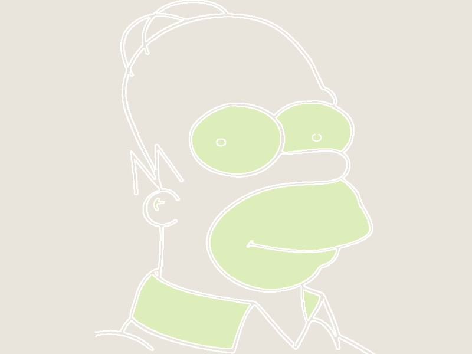
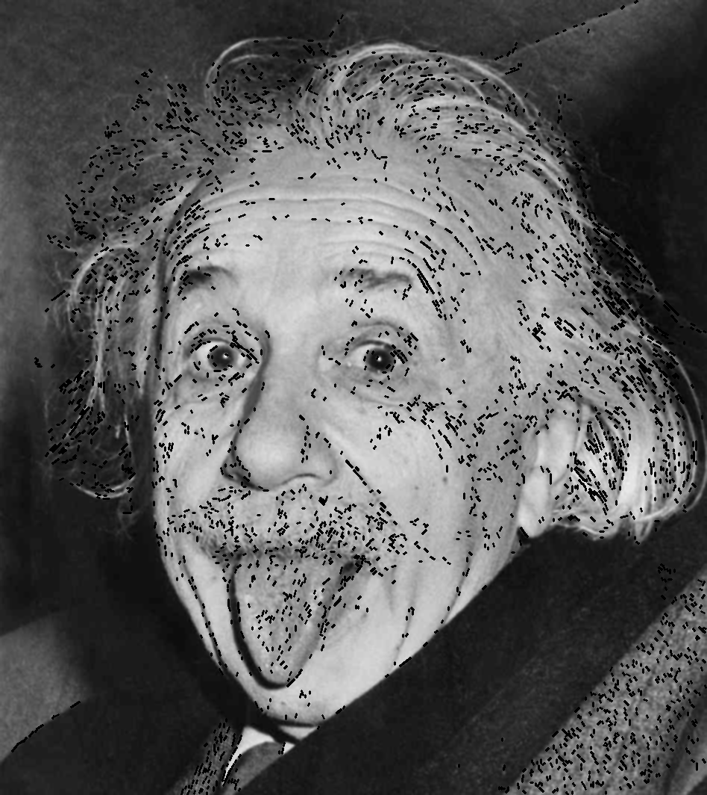
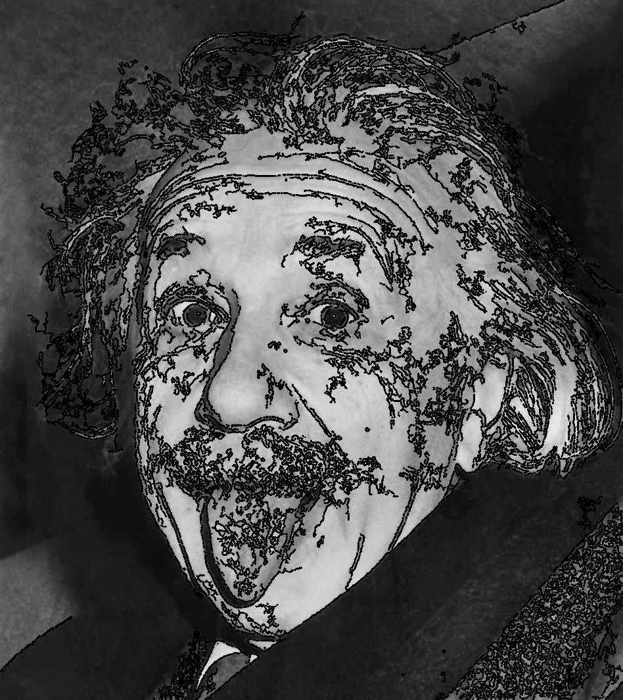

So far, the rendering does not look especially good. The approach I am using finds contours. This means a lot of the times the lines are doubled or when zooming in I get small circles. You can see the double lines in a simple image:

So I wanted to explore other options for finding just the lines in the image. The suggested approach was to use the [Hough transform](http://en.wikipedia.org/wiki/Hough_transform) since it is very good at doing just that: finding (straight) lines. But here lies my problem: since I am focusing on images of people, not objects, there are not that many straight lines. Well, actually there are, but they are very small and disparate. 

But if you find enough of them, you could get an approximation of a larger (non-linear) line, a curve if you may.

Now, merging smaller disparate lines into a larger one is no easy trick. It turned out to be quite a difficult challenge involving [Line simplification](http://bost.ocks.org/mike/simplify/) and [Watershed algorithm](http://en.wikipedia.org/wiki/Watershed_(image_processing)).

Unfortunately, the results were not what I expected so for the moment I am sticking to the contours. While doing all these experiments I actually found out OpenCV can give me some interesting properties of contours like perimeter, area, aspect ratio, solidity, extent, etc., so I can better differentiate between regions on the map and style them accordingly. To get an idea, look at the **_map of Homer_** above and notice that the eyes are drawn not just as streets, but as parks. Hopefully there will be more on that in the next post, but if you are interested I recommend a nice 4-part overview of what is possible with contours at [opencvpython](http://opencvpython.blogspot.ro/2012/06/hi-this-article-is-tutorial-which-try.html). 

