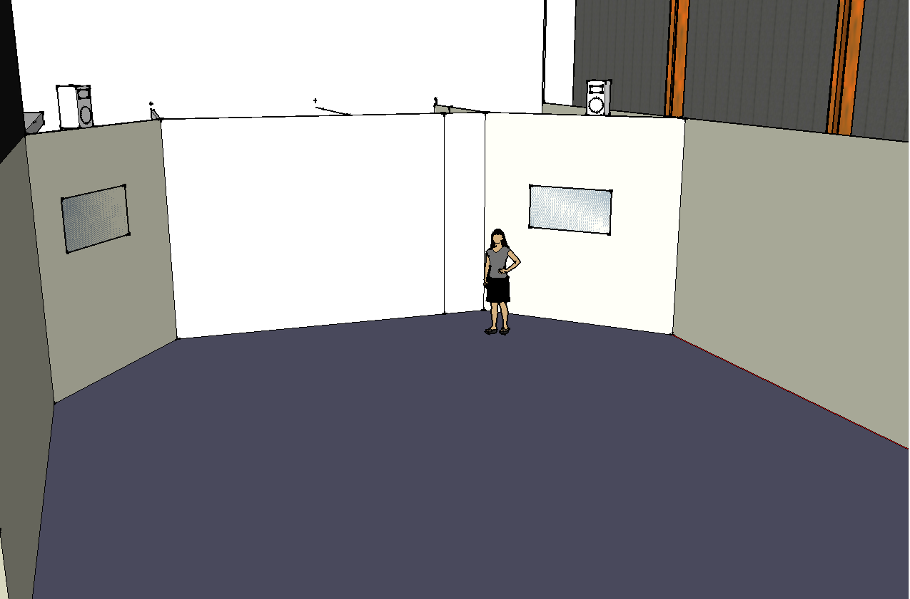

This is an exercise on how I imagine one could put this "experiment" on display. 
Since I had the idea long before the devart project, I imagined it more as a mobile and/or web application. I find it that people love being creative, they like making original "stuff" and sharing it with friends, that's why some of the most popular websites or apps include Youtube, Instagram, Vine, etc. So the original idea was that people would take photos of themselves, of friends and family, favourite places, and so on, "mapify" them and share the results with friends. These are then able to interact with the photo/map/beautiful work of art. You would be able to zoom, pan, rotate, just like you would on a Google map, be it on a mobile phone or on a browser.
As I started working on the devart challenge, I thought about a more immediate and interactive approach. I imagine a room with several screens (just like paintings in a gallery) each being fitted with a small camera. Once a person is detected in front of a camera, a photo is taken. This could be triggered by a specific gesture, a timer, detecting a smile, etc. The photo is transformed into a map and rendered on the screen. On the bottom of the screen a QR code could also be present to allow exploring the piece later on a mobile or even sharing it with someone else. The person could also interact right there with the "painting" by zooming and panning through simple hand gestures.

There could be of course several such screens, each featuring a different algorithm for rendering the map, resulting in simple town maps, cities or complex metro areas. Styling could also differ between these maps, simulating a city map, a geological map, or even a more abstract kind.